# 🌐 OmniProcure — AI-Native Supply Chain & Sourcing Platform

OmniProcure is an **AI-Native Electronics Procurement & Supply Chain Monitoring Platform** engineered to streamline component sourcing for hardware engineers and purchasing teams. By consolidating real-time distributor inventories, automating volatility checks, and providing a tool-equipped agentic command center, OmniProcure collapses BOM analysis and sourcing workflows from hours to seconds.

The platform is designed to run entirely serverless inside a unified Next.js App Router structure, eliminating external automation platforms (like n8n, Make, or Zapier) to ensure low latency and native type safety.

---

## 📌 Table of Contents
1. [System Architecture](#-system-architecture)
2. [User Flows & Usage Guide](#-user-flows--usage-guide)
3. [Key Features](#-key-features)
4. [Tech Stack & Core Integrations](#-tech-stack--core-integrations)
5. [Database Schema & Data Models](#-database-schema--data-models)
6. [AI Sourcing & Decision Logic](#-ai-sourcing--decision-logic)
7. [Environment Configuration](#-environment-configuration)
8. [Local Development Setup](#-local-development-setup)

---

## 🏗️ System Architecture

OmniProcure consolidates user authentication, real-time inventory queries, AI model execution, database caching, and Slack webhooks into a single nextjs codebase.

```mermaid
graph TD
    %% Styling
    classDef frontend fill:#1e293b,stroke:#5ebcf8,stroke-width:2px,color:#f1f5f9;
    classDef backend fill:#1e293b,stroke:#7dd3fc,stroke-width:2px,color:#f1f5f9;
    classDef db fill:#0f172a,stroke:#34d399,stroke-width:2px,color:#f1f5f9;
    classDef external fill:#0f172a,stroke:#fbbf24,stroke-width:2px,color:#f1f5f9;

    %% Frontend Layer
    subgraph Frontend [Next.js Neumorphic UI & Dashboard]
        Landing[Landing Page / app/page.tsx]:::frontend
        Overview[Overview Dashboard / app/dashboard/page.tsx]:::frontend
        ChatUI[Agent Command Center / app/dashboard/chat/page.tsx]:::frontend
        MonitorUI[Monitor & Telemetry Feed / app/dashboard/monitor/page.tsx]:::frontend
        AlertsUI[Alerts Inbox / app/dashboard/alerts/page.tsx]:::frontend
        SettingsUI[Settings & Webhooks / app/dashboard/settings/page.tsx]:::frontend
    end

    %% API Layer
    subgraph API [Serverless API Handlers]
        BOM_API[BOM Sourcing Stream / api/bom/route.ts]:::backend
        Chat_API[Agentic Chat API / api/chat/route.ts]:::backend
        Monitor_API[Monitor & Telemetry API / api/monitor/route.ts]:::backend
        Alerts_API[Alerts CRUD API / api/alerts/route.ts]:::backend
        Audit_API[Audit Logs API / api/audit/route.ts]:::backend
    end

    %% Supabase Data Layer
    subgraph Database [Supabase & DB Layers]
        SupaDB[(PostgreSQL Database)]:::db
        Auth[Supabase Auth & RLS]:::db
    end

    %% Integrations
    subgraph External [Core Integrations]
        Claude[Anthropic Claude API]:::external
        OemSec[OEM Secrets API]:::external
        Resend[Resend Email Delivery]:::external
        LF[Langfuse LLM Tracing]:::external
    end

    %% UI Connections
    Landing -->|Upload BOM Test| BOM_API
    Overview -->|Load Metrics & Lists| SupaDB
    ChatUI -->|Interactive Conversation / BOM Drop| Chat_API
    MonitorUI -->|Add/Remove Watchlist / Toggle Status| Monitor_API
    AlertsUI -->|Fetch / Acknowledge / Delete Alerts| Alerts_API
    SettingsUI -->|Save Webhook Config / Run Integration Test| SupaDB
    SettingsUI -->|Send Verification Mail| Resend

    %% API Connections
    BOM_API -->|1. Parse BOM text| Claude
    BOM_API -->|2. Search stock| OemSec
    BOM_API -->|3. Record Sourced items| SupaDB
    BOM_API -->|4. Log traces| LF
    
    Chat_API -->|Agent Loops & Decisions| Claude
    Chat_API -->|Database & Sourcing Tools| SupaDB
    Chat_API -->|Live Sourcing Queries| OemSec
    Chat_API -->|Trace executions| LF

    Monitor_API -->|Batch Live stock check| OemSec
    Monitor_API -->|Run Risk Assessments| Claude
    Monitor_API -->|Write warnings & audit trails| SupaDB
    Monitor_API -->|Send Slack/Email Notifications| Resend
```



---

## 📖 User Flows & Usage Guide

OmniProcure features a logical user onboarding and operation loop. Follow this guide to fully utilize the platform:

### 1. Sourcing Sandbox (Public Landing Page)
*   **Action**: Go to `/` (Landing Page) and scroll down to the **BOM Sourcing Sandbox**.
*   **Use Case**: Paste raw BOM list lines (e.g., `10x STM32F103C8T6 LQFP-48, 5x ESP32-WROOM-32`) or drop a `.csv`/`.txt` file into the input area.
*   **Result**: The screen opens a real-time Server-Sent Events (SSE) stream. You will see:
    1.  *Claude Parsing*: Extracts structured manufacturer part numbers (MPNs), quantities, and package types.
    2.  *Real-time Sourcing*: Queries the distributor network for active pricing, stock, lead times, and region origins.
    3.  *Interactive Table*: Displays incremental line item results, highlighting the best pricing, stock status, and primary supplier.

### 2. User Sign-In & Dashboard Onboarding
*   **Action**: Log in using `/auth/login` (email/password or magic link) via Supabase Auth.
*   **Use Case**: All dashboard transactions (chat sessions, custom watchlists, settings, triggers, alerts inbox) are dynamically partitioned to your authenticated `user_id` using PostgreSQL **Row Level Security (RLS)**.
*   **Result**: You are redirected to `/dashboard`, presenting a **Bento Grid** overview of your procurement status:
    - *Stats Grid*: Total components monitored, active unread alerts, and distributor API call logs of the day.
    - *Active Feeds*: Split panels highlighting your watched components alongside active supply warnings.

### 3. Agentic Command Center (`/dashboard/chat`)
*   **Action**: Click **Chat** in the navigation bar. 
*   **Use Case**: Interact with the AI Procurement Agent or upload complete BOMs.
*   **Capabilities**:
    - **Natural Sourcing queries**: Ask *"Is there stock for ESP32-WROOM-32?"* or *"Compare pricing for STM32F405RGT6"*. The agent executes the `query_stock` tool under the hood, hits the distributor API, and gives you a sorted comparison table.
    - **Risk Logs**: Ask the agent to *"Show me current alerts"* or *"Check my watchlist parts"*.
    - **Watchlist Modifiers**: Ask the agent to *"Add STM32F103C8T6 to my watchlist"*. It runs the `add_to_watchlist` tool, caching the part inside Supabase and registering it for daily checks.
    - **BOM Ingestion**: Drag a CSV list and drop it into the chat window. The agent parses, sources, registers the parts for telemetry checks, and returns a detailed Excel-like markdown summary of your estimated cost.

### 4. Live Telemetry Feed (`/dashboard/monitor`)
*   **Action**: Click **Monitor** in the navigation bar.
*   **Use Case**: Keep track of the active inventory health of your parts.
*   **Operations**:
    - **Telemetry Status**: Shows parts categorised into *Monitoring* or *Paused*.
    - **Toggles**: Toggle the switch under the *Status* column to deactivate or reactivate daily market checks.
    - **Delete**: Click the trash icon to permanently remove parts from surveillance.
    - **Manual Sourcing Run**: Click **Sourcing Check** at the top right to force-run a market scan on all active parts.

### 5. Alerts Inbox (`/dashboard/alerts`)
*   **Action**: Click **Alerts** in the navigation bar.
*   **Use Case**: Act as the "Human-In-The-Loop" (HITL) gatekeeper to resolve risks.
*   **Alert Types**:
    - *High Priority*: Absolute stockout (0 stock globally) or critical single-source risk (only 1 supplier has stock).
    - *Medium Priority*: Lead times exceeding 8 weeks or low stock pools (less than 500 units globally).
    - *Low Priority*: Watchlist parts experiencing minor pricing adjustments.
*   **Resolutions**: Mark alerts as read/unread or delete them when the sourcing issue has been resolved.

### 6. Settings & Integration Config (`/dashboard/settings`)
*   **Action**: Click **Settings** in the navigation bar.
*   **Use Case**: Connect your supply chain to external messaging channels.
*   **Webhooks**:
    - **Slack**: Toggle Slack webhook, paste your webhook URL, and click **Test** to dispatch a verified check alert directly to your team's Slack channel.
    - **Email Alerts**: Toggle Email notifications, enter your target address, and click **Test** to send a warning notification via Resend.
    - **Danger Zone**: Erase your database configuration logs (clear all alerts, wipe all monitored parts) to start clean.

---

## 🌟 Key Features

1.  **AI Tool Execution Loop**: The chat interface uses Claude Sonnet equipped with functional database tools. The agent determines what tools to invoke, runs the execution block, feeds the results back to its context, and answers in natural markdown.
2.  **Server-Sent Events (SSE) Streaming**: BOM uploads stream results incrementally to prevent browser timeouts during massive batch searches.
3.  **Langfuse Observability**: Deep tracking of agent execution chains, tracing input/output tokens, latency metrics, and API errors on the observability dashboard.
4.  **Automatic Suffix Parsing**: The system splits base MPNs and packaging codes (e.g. `STM32F103C8T6` vs suffix variations) to match equivalents.
5.  **Multi-Currency Engine**: Normalizes foreign distributor currency listings (EUR, JPY, GBP, CAD, AUD, CNY) into USD using daily fixed rate parameters.

---

## 🛠️ Tech Stack & Core Integrations

*   **Framework**: Next.js 16 (App Router) + React 19 + TypeScript
*   **Styling**: Custom CSS Neumorphic variables and utility classes ([glacier.css](file:///c:/Users/kunal/OneDrive/pineapple/OmniProcure/omniprocure/app/dashboard/glacier.css))
*   **Database**: Supabase PostgreSQL with Row Level Security (RLS) policies
*   **Large Language Models (LLMs)**:
    - Anthropic Claude Sonnet (`claude-sonnet-4-20250514`) (Chat agent, tool usage, decisions)
    - Anthropic Claude Haiku (`claude-haiku-4-5-20251001`) (BOM text parsing, structured calculations)
*   **Sourcing Network**: OEM Secrets API (Aggregates real-time feeds from 140+ global suppliers like Mouser, DigiKey, Arrow, Farnell, LCSC)
*   **Observability**: Langfuse SDK (Serverless generation tracking)
*   **Notifications**: Resend API (Transactional alerts) & Slack Incoming Webhooks

---

## 📊 Database Schema & Data Models

Run the [migration.sql](file:///c:/Users/kunal/OneDrive/pineapple/OmniProcure/omniprocure/supabase/migration.sql) script in your Supabase SQL Editor. The database consists of:

```
                      +-------------------+
                      |   users (Profile) |
                      +---------+---------+
                                |
                                | (One-to-Many)
         +----------------------+----------------------+
         |                      |                      |
+--------v-------+      +-------v-------+      +-------v-------+
|   watchlist    |      |    alerts     |      |  bom_uploads  |
+----------------+      +---------------+      +---------------+
| id (PK)        |      | id (PK)       |      | id (PK)       |
| mpn (Normalized|      | mpn           |      | filename      |
| label          |      | urgency       |      | line_items    |
| threshold_stock|      | summary       |      | item_count    |
| user_id (FK)   |      | user_id (FK)  |      | user_id (FK)  |
+----------------+      +---------------+      +---------------+
```

### `search_cache`
Caches supplier listings, Claude rankings, variant options, and equivalent ICs for normalized part numbers to minimize external API costs.
*   `mpn_normalized` (TEXT, Primary Key)
*   `results` (JSONB)
*   `claude_recommendation` (JSONB)
*   `variant_results` (JSONB)
*   `equivalent_ics` (JSONB)
*   `updated_at` (TIMESTAMPTZ)
*   `hit_count` (INTEGER)

### `watchlist`
Stores component MPNs tracked by users for automated price/availability monitoring.
*   `id` (BIGSERIAL, Primary Key)
*   `mpn` (TEXT, Unique)
*   `label` (TEXT)
*   `alert_threshold_stock` (INTEGER, Default: 100)
*   `alert_threshold_weeks` (INTEGER, Default: 8)
*   `last_checked_at` (TIMESTAMPTZ)
*   `last_alert_at` (TIMESTAMPTZ)
*   `user_id` (UUID, Foreign Key)

### `alerts`
Stores logged warnings flagged by automated checks or the AI chat interface.
*   `id` (BIGSERIAL, Primary Key)
*   `mpn` (TEXT)
*   `urgency` (TEXT) - `low` | `medium` | `high`
*   `summary` (TEXT)
*   `recommendation` (TEXT) - `buy_now` | `watch` | `hold`
*   `is_read` (BOOLEAN, Default: false)
*   `flagged_by` (TEXT) - `monitor` | `chat`
*   `created_at` (TIMESTAMPTZ)
*   `user_id` (UUID, Foreign Key)

### `audit_trail`
An immutable log tracking actions, prices, and decisions, serving as a SOC 2 compliant record.
*   `id` (BIGSERIAL, Primary Key)
*   `action` (TEXT)
*   `supplier` (TEXT)
*   `mpn` (TEXT)
*   `unit_price` (NUMERIC)
*   `total_value` (NUMERIC)
*   `decision` (TEXT)
*   `details` (TEXT - JSON formatted logs)
*   `created_at` (TIMESTAMPTZ)

### `bom_uploads`
Archives previously uploaded Bill of Materials documents and their parsed outputs.
*   `id` (BIGSERIAL, Primary Key)
*   `filename` (TEXT)
*   `line_items` (JSONB)
*   `item_count` (INTEGER)
*   `uploaded_at` (TIMESTAMPTZ)
*   `user_id` (UUID, Foreign Key)

---

## 🧠 AI Sourcing & Decision Logic

### 1. Sourcing Aggregator
*   **Currency Translation**: Convert non-USD prices (EUR, GBP, CAD, AUD, JPY, CNY) into USD using predefined exchange multipliers.
*   **Packaging Suffix Normalization**: Matches package types (e.g. `PU` -> DIP, `AU` -> TQFP-32, `TR` -> Tape & Reel) to dynamically fetch and cross-reference component variants.

### 2. Supplier Scoring Metric
Supplier lists retrieved from OEM Secrets are sorted using a custom metric block:
*   **Score 3**: Active pricing + In Stock.
*   **Score 2**: Active pricing + Out of Stock.
*   **Score 1**: Price on request + In Stock.
*   **Score 0**: No pricing + Out of Stock.
*   *Sort Priority*: High Score -> Low Price -> High Available Stock.

### 3. Suffix Replacements
To scan package variants, base part numbers are matched against a suffix table:
*   `T6` / `C8T6` -> LQFP-48
*   `RBT6` -> LQFP-64
*   `AU` -> TQFP-32 (SMD)
*   `PU` / `N` -> DIP (Through-hole)

### 4. Claude Evaluation Matrix
*   Distributor recommendations are weighed by:
    *   **Stock Availability (40%)**
    *   **Unit Price (35%)**
    *   **Lead Time & Reliability (25%)**
*   Only suppliers offering transparent pricing and active stock are considered for recommendations.

### 5. Immediate Alert Triggers
The system immediately logs a **High/Medium Priority Alert** and sends Slack/Email webhooks if a part checks any of the following parameters:
1.  **Single Source Dependency**: Only 1 distributor has active stock.
2.  **Extended Lead Time**: Component lead times exceed 8 weeks.
3.  **Low Available Stock**: Total stock across all distributors drops below 500 units.
4.  **Stockout**: Zero stock available globally.
5.  **No pricing**: Sourced part is only available "on request".

---

## 🚀 Getting Started & Local Development

### 1. Clone the repository and install dependencies
```bash
cd omniprocure
npm install
```

### 2. Run the development server
```bash
npm run dev
```
Open [http://localhost:3000](http://localhost:3000) to view the application.

### 3. Run a build check
```bash
npm run build
```

---

## ⚙️ Environment Configuration

Create a `.env` file in the root directory. Use the template below:

```env
# ── SUPABASE CONFIGURATION (Public and Server Secret)
NEXT_PUBLIC_SUPABASE_URL=https://your-project.supabase.co
NEXT_PUBLIC_SUPABASE_ANON_KEY=eyJhbGciOiJIUzI1NiIsInR5cCI6IkpXVCJ9...
SUPABASE_SERVICE_ROLE_KEY=eyJhbGciOiJIUzI1NiIsInR5cCI6IkpXVCJ9...

# ── DISTRIBUTOR & AI KEYS
OEM_SECRETS_API_KEY=your_oem_secrets_api_key
ANTHROPIC_API_KEY=sk-ant-api03-...

# ── OBSERVABILITY (Langfuse)
LANGFUSE_PUBLIC_KEY=pk-lf-...
LANGFUSE_SECRET_KEY=sk-lf-...
LANGFUSE_HOST=https://cloud.langfuse.com
NEXT_PUBLIC_LANGFUSE_DASHBOARD_URL=https://cloud.langfuse.com/project/...

# ── ALERTS & WEBHOOKS
NOTIFY_WEBHOOK_URL=https://hooks.slack.com/services/...
RESEND_API_KEY=re_...
NEXT_PUBLIC_APP_URL=http://localhost:3000

# ── OAUTH INTEGRATION (Optional for Gmail Watch)
GOOGLE_OAUTH_CLIENT_ID=your_google_client_id.apps.googleusercontent.com
GOOGLE_OAUTH_CLIENT_SECRET=your_google_client_secret
GOOGLE_CLOUD_PROJECT_ID=your_gcp_project_id
GMAIL_PUBSUB_TOPIC=gmail-ingest
```

---
*Created and maintained by the OmniProcure Sourcing & Hardware Engineering team.*
