# 🌐 OmniProcure

OmniProcure is an **AI-Native Electronics Procurement & Supply Chain Monitoring Platform** built to streamline component sourcing for hardware engineers and supply chain teams. By consolidating real-time distributor inventories, automating risk assessments, and leveraging an agentic LLM command center, OmniProcure cuts components sourcing and BOM analysis times from **hours to minutes**.

---

## 📌 Table of Contents
1. [System Architecture](#-system-architecture)
2. [Key Features](#-key-features)
3. [Tech Stack & Integrations](#-tech-stack--integrations)
4. [Database Schema & Data Models](#-database-schema--data-models)
5. [AI Sourcing & Decision Logic](#-ai-sourcing--decision-logic)
6. [Getting Started & Local Development](#-getting-started--local-development)
7. [Environment Configuration](#-environment-configuration)

---

## 🏗️ System Architecture

OmniProcure is engineered as a modern, unified Next.js application, eliminating the need for complex external orchestrators (like n8n or Make). Sourcing logic, database interactions, and agentic loops run entirely in serverless API endpoints using a single codebase.

```mermaid
graph TD
    %% Frontend Layer
    subgraph Frontend [Next.js UI & Dashboard]
        UI[Landing Page & BOM Demo]
        Dash[Overview Dashboard]
        ChatUI[AI Chat Command Center]
        MonUI[Monitor & Telemetry Feed]
        AlertsUI[Alerts Manager]
        SettingsUI[Settings & Integrations]
    end

    %% API / Server Layer
    subgraph Backend [Next.js Serverless API Routes]
        BOM_API[BOM Parser API]
        Chat_API[Agentic Chat API]
        Mon_API[Monitor & Telemetry API]
        Alerts_API[Alerts API]
        Audit_API[SOC 2 Audit API]
        Cron_API[Internal Cron Endpoint]
    end

    %% Sourcing & LLM Services
    subgraph Services [External Integrations]
        Claude[Anthropic Claude API]
        OemSec[OEM Secrets API]
        Resend[Resend Email API]
        LF[Langfuse Observability]
    end

    %% Database Layer
    subgraph DB [Supabase Backend]
        SupaDB[(PostgreSQL Database)]
        Auth[Supabase Auth & RLS]
    end

    %% Flows
    UI -->|Paste Text/CSV| BOM_API
    Dash -->|Fetch Telemetry| SupaDB
    ChatUI -->|Drag-and-Drop BOM / Chat| Chat_API
    MonUI -->|Run Checks / Toggle Parts| Mon_API
    AlertsUI -->|Mark Read / Delete| Alerts_API
    SettingsUI -->|Save Config / Test integrations| Resend

    %% API to DB and Services
    BOM_API -->|Parse| Claude
    BOM_API -->|Sourcing Query| OemSec
    BOM_API -->|Save Upload & Parts| SupaDB
    
    Chat_API -->|Agent Loop / Tool Use| Claude
    Chat_API -->|Sourcing Query| OemSec
    Chat_API -->|Store Messages / Alerts| SupaDB
    Chat_API -->|Log Traces| LF

    Mon_API -->|Query Live Stocks| OemSec
    Mon_API -->|Risk Analysis| Claude
    Mon_API -->|Write Alerts & Audit logs| SupaDB
    Mon_API -->|Send Alerts| Resend
    
    Cron_API -->|Trigger Checks| Mon_API
    Cron_API -->|Renew Mail Watch| SupaDB

    SupaDB -.->|Protected by| Auth
```



---

## 🌟 Key Features

### 1. Unified Sourcing Dashboard (`/dashboard`)
*   **Volatiles Snapshot**: Instant status checks on active monitored components, unread warnings, and daily distributor API call statistics.
*   **Visual telemetry feed**: Lists parts added to the watchlist, showing their current check-times and telemetry health logs.
*   **Human-In-The-Loop (HITL) Alerts**: Displays recent alerts requiring instant decisions or procurement modifications.

### 2. Agentic Command Center (`/dashboard/chat`)
*   **Tool-Equipped Agent**: Built using Claude (`claude-sonnet-4-20250514`) with a custom execution loop that invokes tools dynamically to query stocks, modify watchlists, create or resolve alerts, and trigger active runs.
*   **BOM Ingestion**: Accepts drag-and-drop BOM files (CSV/TXT) directly inside the conversation, parses items using Claude, queries distributor API, and registers them for monitoring.
*   **Historical Sessions**: Keeps chat sessions scoped to individual authenticated users.

### 3. Supply Chain Monitor (`/dashboard/monitor`)
*   **Telemetry Telemetry**: Visual display showing components categorized as *In Stock*, *Low Stock*, or *Out of Stock*.
*   **Telemetry Feeds**: Filters and monitors live market data, letting users toggle active alerts on or off, edit component requirements, or clean up inactive parts.

### 4. Risk Alert Manager (`/dashboard/alerts`)
*   **Critical Risk Flags**: Automatically identifies single-source dependencies, lead times exceeding 8 weeks, total global stock under 500 units, and price anomalies.
*   **Urgency Levels**: Visual badge markers for *High*, *Medium*, and *Low* priority alerts.
*   **Action Recommendations**: AI suggests whether to *Buy Now*, *Watch*, or *Hold*.
*   **Dismissal**: Supports reading, deleting, and batch-resolving alerts.

### 5. Langfuse Observability (`/dashboard/observability`)
*   **Trace Insights**: Embedded Langfuse dashboard showing live API calls, latency graphs, token consumption, and agent step-by-step tool usages.
*   **Error Shielding**: Built-in silent catchers prevent logging system failures from breaking core procurement logic.

### 6. Notifications & Danger Zone Settings (`/dashboard/settings`)
*   **Slack Webhooks**: Post alerts instantly to dedicated Slack channels.
*   **Alert Emails**: High-priority notifications delivered via Resend.
*   **Monitoring Tiers**: Toggles frequency options (e.g. 24h for free, 6h for premium/founding members).
*   **Database Purge**: Danger zone buttons to permanently clear alerts and tracked parts.

---

## 🛠️ Tech Stack & Integrations

*   **Frontend & Routing**: [Next.js 16 (App Router)](https://nextjs.org/) + React 19 + TypeScript.
*   **Database & Authentication**: [Supabase](https://supabase.com/) (PostgreSQL with Row Level Security policies and `@supabase/ssr` cookies handler).
*   **AI Models**:
    *   `claude-sonnet-4-20250514` (Powering agentic loops, chat decision workflows, and tool execution).
    *   `claude-haiku-4-5-20251001` (Evaluating BOM formats, parsing text files, mapping variants, and drafting negotiation emails).
*   **Inventory Telemetry API**: [OEM Secrets API](https://oemsecrets.com/) (Consolidates real-time listings from Mouser, DigiKey, Arrow, Farnell, LCSC, RS Components, and 130+ other distributors).
*   **LLM Tracing**: [Langfuse SDK](https://langfuse.com/) (Captures serverless execution loops and token metrics).
*   **Emails**: [Resend API](https://resend.com/) (Template rendering and delivery for warnings).

---

## 📊 Database Schema & Data Models

Run the [migration.sql](file:///c:/Users/kunal/OneDrive/pineapple/OmniProcure/omniprocure/supabase/migration.sql) script in your Supabase SQL Editor. The database consists of:

### `search_cache`
Caches supplier listings, Claude rankings, variant options, and equivalent ICs for normalized part numbers to minimize external API costs.
*   `mpn_normalized` (TEXT, Primary Key)
*   `results` (JSONB)
*   `claude_recommendation` (JSONB)
*   `variant_results` (JSONB)
*   `equivalent_ics` (JSONB)
*   `updated_at` (TIMESTAMPTZ)
*   `hit_count` (INTEGER)

### `watchlist`
Stores component MPNs tracked by users for automated price/availability monitoring.
*   `id` (BIGSERIAL, Primary Key)
*   `mpn` (TEXT, Unique)
*   `label` (TEXT)
*   `alert_threshold_stock` (INTEGER, Default: 100)
*   `alert_threshold_weeks` (INTEGER, Default: 8)
*   `last_checked_at` (TIMESTAMPTZ)
*   `last_alert_at` (TIMESTAMPTZ)
*   `user_id` (UUID, Foreign Key)

### `alerts`
Stores logged warnings flagged by automated checks or the AI chat interface.
*   `id` (BIGSERIAL, Primary Key)
*   `mpn` (TEXT)
*   `urgency` (TEXT) - `low` | `medium` | `high`
*   `summary` (TEXT)
*   `recommendation` (TEXT) - `buy_now` | `watch` | `hold`
*   `is_read` (BOOLEAN, Default: false)
*   `flagged_by` (TEXT) - `monitor` | `chat`
*   `created_at` (TIMESTAMPTZ)
*   `user_id` (UUID, Foreign Key)

### `audit_trail`
An immutable log tracking actions, prices, and decisions, serving as a SOC 2 compliant record.
*   `id` (BIGSERIAL, Primary Key)
*   `action` (TEXT)
*   `supplier` (TEXT)
*   `mpn` (TEXT)
*   `unit_price` (NUMERIC)
*   `total_value` (NUMERIC)
*   `decision` (TEXT)
*   `details` (TEXT - JSON formatted logs)
*   `created_at` (TIMESTAMPTZ)

### `bom_uploads`
Archives previously uploaded Bill of Materials documents and their parsed outputs.
*   `id` (BIGSERIAL, Primary Key)
*   `filename` (TEXT)
*   `line_items` (JSONB)
*   `item_count` (INTEGER)
*   `uploaded_at` (TIMESTAMPTZ)
*   `user_id` (UUID, Foreign Key)

---

## 🧠 AI Sourcing & Decision Logic

### 1. Sourcing Aggregator
*   **Currency Translation**: Convert non-USD prices (EUR, GBP, CAD, AUD, JPY, CNY) into USD using predefined exchange multipliers.
*   **Packaging Suffix Normalization**: Matches package types (e.g. `PU` -> DIP, `AU` -> TQFP-32, `TR` -> Tape & Reel) to dynamically fetch and cross-reference component variants.

### 2. Claude Evaluation Matrix
*   Distributor recommendations are weighed by:
    *   **Stock Availability (40%)**
    *   **Unit Price (35%)**
    *   **Lead Time & Reliability (25%)**
*   Only suppliers offering transparent pricing and active stock are considered for recommendations.

### 3. Immediate Alert Triggers
The system immediately logs a **High/Medium Priority Alert** and sends Slack/Email webhooks if a part checks any of the following parameters:
1.  **Single Source Dependency**: Only 1 distributor has active stock.
2.  **Extended Lead Time**: Component lead times exceed 8 weeks.
3.  **Low Available Stock**: Total stock across all distributors drops below 500 units.
4.  **Stockout**: Zero stock available globally.
5.  **No pricing**: Sourced part is only available "on request".

---

## 🚀 Getting Started & Local Development

### 1. Clone the repository and install dependencies
```bash
cd omniprocure
npm install
```

### 2. Run the development server
```bash
npm run dev
```
Open [http://localhost:3000](http://localhost:3000) to view the application.

### 3. Run a build check
```bash
npm run build
```

---

## ⚙️ Environment Configuration

Create a `.env` file in the root directory. Use the template below:

```env
# ── SUPABASE CONFIGURATION (Public and Server Secret)
NEXT_PUBLIC_SUPABASE_URL=https://your-project.supabase.co
NEXT_PUBLIC_SUPABASE_ANON_KEY=eyJhbGciOiJIUzI1NiIsInR5cCI6IkpXVCJ9...
SUPABASE_SERVICE_ROLE_KEY=eyJhbGciOiJIUzI1NiIsInR5cCI6IkpXVCJ9...

# ── DISTRIBUTOR & AI KEYS
OEM_SECRETS_API_KEY=your_oem_secrets_api_key
ANTHROPIC_API_KEY=sk-ant-api03-...

# ── OBSERVABILITY (Langfuse)
LANGFUSE_PUBLIC_KEY=pk-lf-...
LANGFUSE_SECRET_KEY=sk-lf-...
LANGFUSE_HOST=https://cloud.langfuse.com
NEXT_PUBLIC_LANGFUSE_DASHBOARD_URL=https://cloud.langfuse.com/project/...

# ── ALERTS & WEBHOOKS
NOTIFY_WEBHOOK_URL=https://hooks.slack.com/services/...
RESEND_API_KEY=re_...

# ── CRON SCHEDULER
CRON_SECRET=your_secured_cron_trigger_string
NEXT_PUBLIC_APP_URL=http://localhost:3000

# ── OAUTH INTEGRATION (Optional for Gmail Watch)
GOOGLE_OAUTH_CLIENT_ID=your_google_client_id.apps.googleusercontent.com
GOOGLE_OAUTH_CLIENT_SECRET=your_google_client_secret
GOOGLE_CLOUD_PROJECT_ID=your_gcp_project_id
GMAIL_PUBSUB_TOPIC=gmail-ingest
```

---
*Created and maintained by the OmniProcure Sourcing & Hardware Engineering team.*
